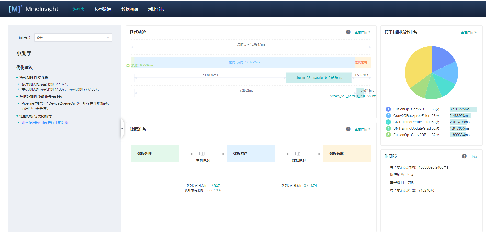
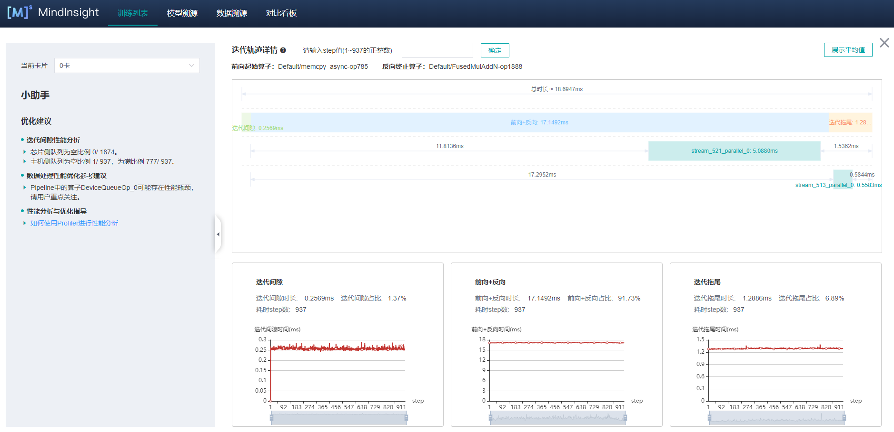
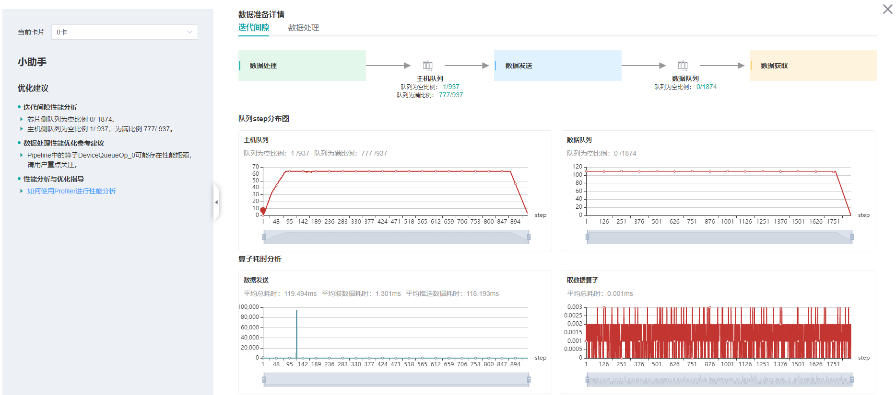
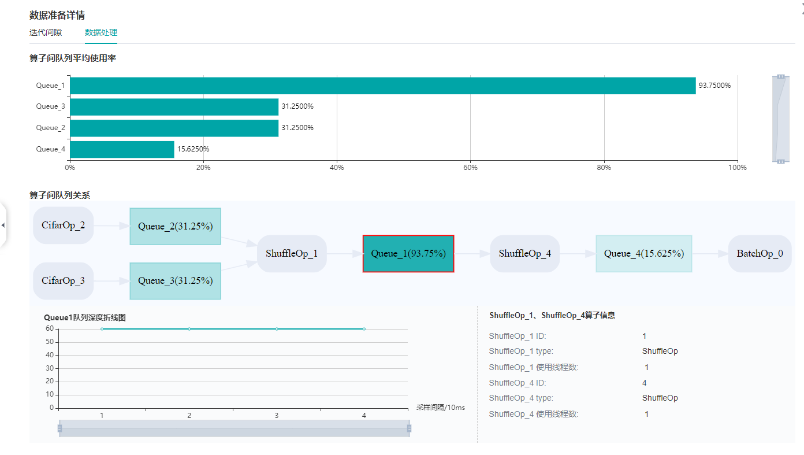
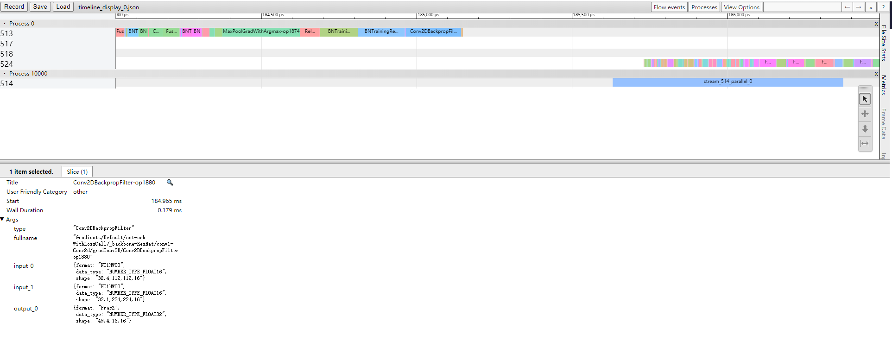

# MindInsight Profiler Introduction

MindInsight Profiler is a performance analysis tool for MindSpore. It can help to analyse and optimize the performance of the neural networks.

The Profiler enables users to:

* Start/finish profiling the neural networks by adding two simple Profiler APIs to the script.
* Analyse the performance of the operators in the neural network. 

## Add profiling code to MindSpore script

To enable profiling in MindSpore, the MindInsight Profiler APIs should be added to the script:

1. Import the Profiler
    ```
    from mindspore.profiler import Profiler
    ```
2. Initialize the Profiler between setting the context and initializing the network and hccl.  

    Example:
        
        context.set_context(mode=context.GRAPH_MODE, device_target="Ascend", device_id=int(os.environ["DEVICE_ID"]))
        profiler = Profiler(output_path="./data", is_detail=True, is_show_op_path=False, subgraph='all')
        net = Net()
        
    Parameters of the Profiler should include the following:
    
         subgraph (str): Defines which subgraph to monitor and analyse, can be 'all', 'Default', 'Gradients'.
         is_detail (bool): Whether to show profiling data for op_instance level, only show optype level if False.
         is_show_op_path (bool): Whether to save the full path for each op instance.
         output_path (str): Output data path.
         optypes_to_deal (list): Op type names, the data of which optype should be collected and analysed,
                                will deal with all op if null.
         optypes_not_deal (list): Op type names, the data of which optype will not be collected and analysed.

3. Call ```Profiler.analyse()``` at the end of the program

    ```Profiler.analyse()``` will collect profiling data and generate the analysis results.

After training, we can analyse the performance through the MindInsight UI.

## Performance Analysis

Users can access to the Performance Profiler by selecting a specific training from the training list, and click the performance profiling link.



Figure 1： Overall Performance

Figure 1 displays the overall performance of the training, including the overall data of Step Trace, Operator Performance, MindData Performance and Timeline.
Users can click the corresponding link to check the details of each components. Besides, the MindInsight Profiler could analyse the performance data. The assistant on the left 
would show performance tuning suggestions for this training.

### Step Trace Analysis

The Step Trace Component is used to show the general performance of the stages in the training. Step Trace will divide the training into several stages:
Step Gap, Forward/Backward Propagation, All Reduce and Parameter Update. It will show the execution time for each stage, and help to find the bottleneck
stage quickly.



Figure 2： Step Trace Analysis

Figure 2 displays the Step Trace page. The Step Trace detail will show the start/finish time for each stage. By default, it shows the average time for all the steps. Users
can also choose a specific step to see its step trace statistics. The graphs at the bottom of the page show how the execution time of Step Gap, Forward/Backward Propagation and
Step Tail changes according to different steps, it helps users to decide whether the performance of some stages could be further optimized.

*Notice:* MindSpore chooses the Forward Start/Backward End Operators automatically, The names of the two operators are shown on the page. The Profiler does not guarantee that these two operators are
always chosen as the user's expectation. Users can choose the two operators according to the execution graph, and specify (delete the) the them manually by setting the `FP_POINT` and `BP_POINT` environment variables.
For example: `export FP_POINT=fp32_vars/conv2d/conv2Dfp32_vars/BatchNorm/FusedBatchNorm_Reduce` and `export BP_POINT=loss_scale/gradients/AddN_70`. 

### Operator Performance Analysis

The operator performance analysis component is used to display the execution time of the operators during MindSpore runtime.
 
 
 
Figure 3: Statistics for Operator Types
 
Figure 3 displays the statistics for the operator types, including:
 
- Choose pie or bar graph to show the proportion time occupied by each operator type. The time of one operator type is calculated by accumulating the execution time of operators belong to this type.   
- Display top 20 operator types with the longest execution time, show the proportion and execution time (ms) of each operator type.


Figure 4: Statistics for Operators

Figure 4 displays the statistics table for the operators, including:

- Choose All: Display statistics for the operators, including operator name, type, execution time, full scope time, information, etc. The table will be sorted by execution time by default.
- Choose Type: Display statistics for the operator types, including operator type name, execution time, execution frequency and proportion of total time. Users can click on each line, querying for all the operators belong to this type.
- Search: There is a search box in the upper right corner, which can support fuzzy search for operators/operator types.

### MindData Performance Analysis

The MindData performance analysis component is used to analyse the execution of data input pipeline for the training. The data input pipeline can be divided into three stages:
the data process pipeline, data transfer from host to device and data fetch on device. The component could analyse the performance of each stage for detail and display the results.



Figure 5： MindData Performance Analysis

Figure 5 displays the page of MindData performance analysis component. It consists of two tabs: The step gap and the data process.

The Step Gap tab is used to analyse whether there is a performance bottleneck in the three stages. Conclusions can be drawn the data queue graphs:

- The data queue size stands for the queue length when the training fetches data from the queue on the device. If the data queue size is 0, the training will wait until there is data in
the queue; If the data queue size is above 0, the training can get data very quickly, and it means MindData is not the bottleneck for this training step.
- The host queue size can be used to infer the speed of data process and data transfer. If the host queue size is 0, it means we need to speed up the data process stage.
- If the host queue remains a big size and the data queue size is very small, the data transfer may be the bottleneck.  



Figure 6： Data Process Pipeline Analysis

Figure 6 displays the page of data process pipeline analysis. The data queues are used to exchange data between the MindData operators. The data size of the queues reflects the
data consume speed of the operators, and can be used to infer the bottleneck operator. The queue usage percentage stands for the average value of the data size in queue divide data queue maximum size. The higher
the usage percentage, the more data that are accumulated in the queue. The graph at the bottom of the page shows the MindData pipeline operators with the data queues, the user can click one queue to see how
the data size changes according to the time, and the operators connected to the queue. The data process pipeline can be analysed as follows:

- When the input queue usage percentage of one operator is high, and the output queue usage percentage is low, the operator may be the bottleneck;
- For the leftmost operator, if the usage percentage of the queues on the right are all low, the operator may be the bottleneck;
- For the rightmost operator, if the usage percentage of the queues on th left are all high, the operator may be the bottleneck. 

To optimize the perforamnce of MindData operators, there are some suggestions:

- If the `Dataset` Operator is the bottleneck, try to increase the `num_parallel_workers`;
- If a `GeneratorOp` type operator is the bottleneck, try to increase the `num_parallel_workers` and replace the operator to `MindRecordDataset`;
- If a `MapOp` type operator is the bottleneck, try to increase the `num_parallel_workers`; If it is a python operator, try to optimize the training script;
- If a `BatchOp` type operator is the bottleneck, try to adjust the size of `prefetch_size`. 

### Timeline Analysis

The Timeline component can display：

- The operators (AICore/AICPU operators) are executed on which device;
- The MindSpore stream split strategy for this neural network;
- The time of tasks executed on the device.

How to view the timeline:

To view the detailed information of the timeline, you can click the "Download" button to save the file with the timeline information locally, and then view it through the tool.

We recommend you to use Google plugin: chrome://tracing, or Perfetto tool: https://ui.perfetto.dev/#!viewer.

- Select one of the tools mentioned above, enter the address in the browser and press Enter;
- After entered the page, click the button to load the file to view the timeline.
- For chrome tracing, using "load" button in the upper left corner.
- For Perfetto, using "Open trace file" in the left column.

Users can get the most detailed information from the Timeline:

- From the high level, users can analyse whether the stream split strategy can be optimized and whether the step tail is too long;
- From the low level, users can analyse the execution time for all the operators, etc.



Figure 7 Timeline Analysis

The Timeline consists of the following parts:

- *Device and Stream List*: It can show the stream list on each device. Each stream consists of a series of tasks. One rectangle stands for one task, and the area stands for the execution time of the task;
- *The Operator Information*: When we click one task, the corresponding operator of this task will be shown at the bottom. 

W/A/S/D can be applied to zoom in and out the timeline graph.

## Limitations

The Profiler has the following limitations now:

* Only programs running on the Ascend chip are supported.
* To limit the data size generated by the Profiler, it is suggested that for a large neural network, the profiled steps should better be below 10.
* The parse of Timeline data is time consuming, and several step's data is usually enough for analysis. In order to speed up the data parse and UI
display, Profiler will show at most 20M data (Contain 10+ step information for large networks).